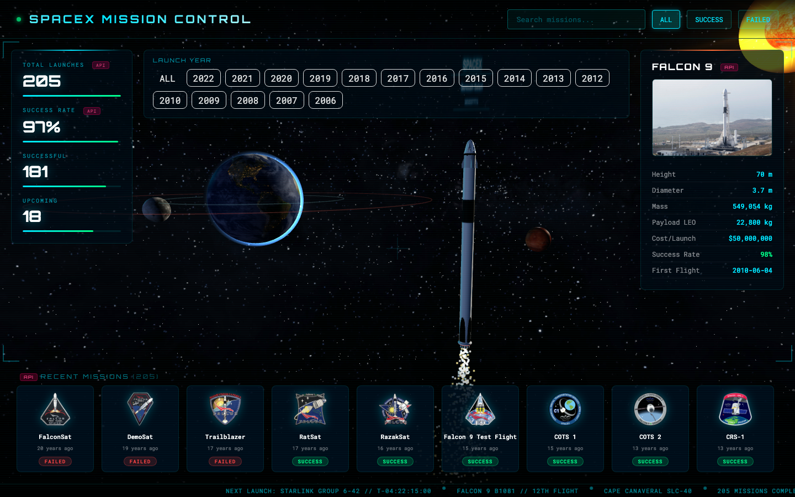
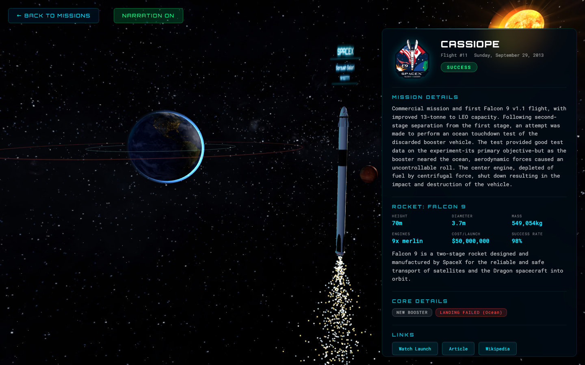

# COMP3133 - Full Stack Development II
# Lab Test 2 - SpaceX Mission Control

**Student Name:** Soroush Salari
**Student ID:** 101537771
**Date:** April 8, 2026
**Option:** 2a - SpaceX Mission Theme

---

## GitHub Repository

https://github.com/SOROUSH911/101537771_comp3133_labtest2

## Deployment (Vercel)

https://spacex-mission-control-soroushsalari2023s-projects.vercel.app

---

## 1. Running Application Screenshots

### Main Page - Mission Control Dashboard


The main page features a full 3D space scene rendered with Three.js showing Earth with clouds and atmosphere, Moon orbiting Earth, Mars, Sun with animated plasma shader and corona effects, and a Falcon 9 rocket model with engine exhaust particles. The HUD overlay displays:
- **Header** with animated "SPACEX MISSION CONTROL" title, search input, and filter buttons (ALL/SUCCESS/FAILED)
- **Stats Panel** (left) showing live API data: Total Launches (205), Success Rate (97%), Successful (181), Upcoming (18)
- **Rocket Panel** (right) showing Falcon 9 specs fetched from the API: height, diameter, mass, payload, cost, success rate, first flight
- **Mission Cards Strip** (bottom) with horizontally scrollable mission cards showing patch images, mission names, and success/fail badges
- **Bottom Ticker** with scrolling launch information

### Launch Detail Page - CassiOPE Mission


The detail page shows comprehensive mission information fetched from the SpaceX API:
- **Mission patch** and name with flight number and date
- **Mission Details** - full description of the launch
- **Rocket Specifications** - Falcon 9 stats (height, mass, cost, engines) from `/v4/rockets/:id`
- **Core Details** - booster reuse status and landing information
- **Links** - YouTube webcast, article, Wikipedia
- The detail panel slides in from the right with a smooth animation
- Back button and Narration toggle button at the top
- Background rocket engine sound plays automatically

---

## 2. Code Screenshots

### SpaceX Service (API Calls)
**File:** `src/app/services/spacex.ts`

```typescript
@Injectable({ providedIn: 'root' })
export class SpacexService {
  private readonly API = 'https://api.spacexdata.com/v4';

  readonly launches = signal<Launch[]>([]);
  readonly rockets = signal<Rocket[]>([]);
  readonly loading = signal(true);
  readonly hoveredRocketId = signal<string>('5e9d0d95eda69973a809d1ec');
  readonly zoomToRocket = signal<boolean>(false);
  readonly cinematicActive = signal<boolean>(false);

  constructor(private http: HttpClient) {}

  loadLaunches() {
    this.loading.set(true);
    this.http.get<Launch[]>(`${this.API}/launches`).subscribe({
      next: (data) => {
        this.launches.set(data);
        this.loading.set(false);
      },
    });
  }

  loadRockets() {
    this.http.get<Rocket[]>(`${this.API}/rockets`).subscribe({
      next: (data) => this.rockets.set(data),
    });
  }

  getLaunchById(id: string) {
    return this.http.get<Launch>(`${this.API}/launches/${id}`);
  }

  getRocketById(id: string) {
    return this.http.get<Rocket>(`${this.API}/rockets/${id}`);
  }
}
```

### Mission List Component (Search, Filter, @for, @if, @switch, Signal)
**File:** `src/app/components/mission-list/mission-list.ts`

```typescript
export class MissionList implements OnInit {
  searchQuery = signal('');
  filterStatus = signal<FilterStatus>('all');
  selectedRocket = signal<Rocket | null>(null);

  filteredLaunches = computed(() => {
    let launches = this.spacex.launches();
    const query = this.searchQuery().toLowerCase();
    const status = this.filterStatus();

    if (query) {
      launches = launches.filter(l =>
        l.name.toLowerCase().includes(query)
      );
    }

    switch (status) {
      case 'success': launches = launches.filter(l => l.success === true); break;
      case 'failed': launches = launches.filter(l => l.success === false); break;
      case 'upcoming': launches = launches.filter(l => l.upcoming); break;
    }
    return launches;
  });

  stats = computed(() => {
    const all = this.spacex.launches();
    const successes = all.filter(l => l.success === true).length;
    return {
      total: all.length,
      success: successes,
      rate: all.length ? Math.round((successes / all.filter(l => l.success !== null).length) * 100) : 0,
    };
  });
}
```

### Mission List Template (@for, @if, @switch usage)
**File:** `src/app/components/mission-list/mission-list.html`

```html
<!-- @switch for filter label -->
@switch (filterStatus()) {
  @case ('success') { SUCCESSFUL MISSIONS }
  @case ('failed') { FAILED MISSIONS }
  @default { RECENT MISSIONS }
}

<!-- @for loop for mission cards -->
@for (launch of filteredLaunches(); track launch.id) {
  <div class="mission-card" (click)="openLaunch(launch)">
    @if (launch.links.patch.small) {
      
    } @else {
      <div class="patch-placeholder">#{{ launch.flight_number }}</div>
    }
    <div class="mission-name">{{ launch.name }}</div>
    <div class="mission-date">{{ launch.date_utc | timeAgo }}</div>
    <span class="mission-badge" [ngClass]="getStatusClass(launch)">
      {{ getStatusText(launch) }}
    </span>
  </div>
} @empty {
  <div class="no-results">No missions found.</div>
}
```

### Custom Pipe - TimeAgoPipe
**File:** `src/app/pipes/time-ago-pipe.ts`

```typescript
@Pipe({ name: 'timeAgo' })
export class TimeAgoPipe implements PipeTransform {
  transform(value: string): string {
    const date = new Date(value);
    const now = new Date();
    const diff = now.getTime() - date.getTime();
    const days = Math.floor(diff / (1000 * 60 * 60 * 24));
    const years = Math.floor(days / 365);
    if (years > 0) return `${years} year${years > 1 ? 's' : ''} ago`;
    // ... months, days, hours, minutes
    return 'just now';
  }
}
```

### TypeScript Models
**File:** `src/app/models/launch.model.ts`

```typescript
export interface Launch {
  id: string;
  name: string;
  flight_number: number;
  date_utc: string;
  success: boolean | null;
  details: string | null;
  upcoming: boolean;
  rocket: string;
  crew: string[];
  links: {
    patch: { small: string | null; large: string | null };
    flickr: { original: string[] };
    webcast: string | null;
    article: string | null;
    wikipedia: string | null;
  };
  cores: { reused: boolean | null; landing_success: boolean | null; landing_type: string | null }[];
  failures: { time: number; reason: string }[];
}
```

### App Configuration (HttpClient, Router)
**File:** `src/app/app.config.ts`

```typescript
export const appConfig: ApplicationConfig = {
  providers: [
    provideBrowserGlobalErrorListeners(),
    provideRouter(routes),
    provideHttpClient()
  ]
};
```

---

## 3. Output UI

### UI Features
- **3D Background**: Three.js rendered space scene with planets, sun, rocket, and star particles
- **HUD Overlay**: Glassmorphism panels with cyan neon accents, Orbitron font
- **Interactive Cards**: Hover to change rocket model and specs panel; click for cinematic + detail
- **Cinematic Camera**: On mission click, camera drills from rocket text label down to engines
- **Text-to-Speech**: Automatic narration of mission details using Web Speech API
- **Sound Effects**: Rocket engine rumble on detail pages
- **Smooth Animations**: Slide-in detail panel, fade transitions, animated stat counters

### API Endpoints Used
| Endpoint | Method | Purpose |
|---|---|---|
| `/v4/launches` | GET | Fetch all 205+ SpaceX launches |
| `/v4/rockets` | GET | Fetch all 4 SpaceX rockets |
| `/v4/launches/:id` | GET | Fetch single launch details |
| `/v4/rockets/:id` | GET | Fetch single rocket specifications |

### Angular Features Used
| Feature | Location |
|---|---|
| HttpClient | `SpacexService` |
| FormsModule | `MissionList` (ngModel search) |
| ReactiveFormsModule | `MissionList` (imported) |
| @for | Mission cards loop |
| @if | Loading, patches, details |
| @switch | Filter status label |
| Signal | 10+ signals across services/components |
| computed() | `filteredLaunches`, `stats`, `availableYears` |
| Custom Pipe | `TimeAgoPipe` |
| Routing | 2 routes: `/` and `/launch/:id` |
| Services | `SpacexService`, `TtsService`, `AudioService` |
